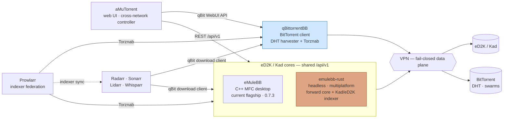

# eMuleBB

[](https://github.com/emulebb/emulebb/actions/workflows/baseline.yml)
[](https://github.com/emulebb/emulebb/actions/workflows/controlled-smoke.yml)
[](https://github.com/emulebb/emulebb/actions/workflows/nightly.yml)
[](https://github.com/emulebb/emulebb-build-tests/actions/workflows/fast-harness-ci.yml)
[](https://github.com/emulebb/emulebb-tooling/actions/workflows/docs-site.yml)
[](https://github.com/emulebb/emulebb-build/actions/workflows/baseline.yml)

This is the home of **eMuleBB**, the compact public name for
**eMule broadband edition**.

eMuleBB began as a broadband-focused Windows eMule line — eD2K, Kad, rare files,
deliberate sharing, long-running sessions — and is growing into a full
peer-to-peer suite: a multiplatform core, a BitTorrent companion, and a
cross-network controller, all behind shared, automatable contracts.

The organization around it is a practical P2P workshop. We build the clients, the
controller, the release and test machinery, the public documentation, and the
protocol work that keeps it honest — shipping a stable Windows client today while
the multiplatform core takes shape.

The current public release, **0.7.3**, is published on GitHub Releases with
matching suite bootstrap and aMuTorrent controller packages.

## What We Offer

eMuleBB is a **complete, privacy-first peer-to-peer suite** for people who take
file sharing seriously — built on classic eD2K/Kad, extended to BitTorrent, and
designed to run safely and automatically.

- **Two networks, one stack.** A broadband-tuned eD2K/Kad client plus a
  BitTorrent companion, managed from a single controller — discover and move
  files across both worlds.
- **VPN-aware by design.** The data plane is built to ride your VPN interface, so
  peer traffic stays on your tunnel. (Fail-closed binding is being hardened across
  the suite.)
- **No central servers or indexers required.** Kad and the BitTorrent DHT do the
  discovery; you run your own search. Nothing to shut down.
- **Built for automation.** A native REST API plus Torznab and
  qBittorrent-compatible adapters drop straight into Prowlarr, Sonarr, Radarr, and
  the aMuTorrent controller.

**Today:** run the Windows client (eMuleBB `0.7.3`) with the aMuTorrent
controller and the one-line suite installer. **Next:** a multiplatform core
(`emulebb-rust`) with autonomous Kad/eD2K indexing and cross-network library
bridging — see the eMuleBB Suite direction below.

## At A Glance

| Area | Current public status |
| --- | --- |
| Product | eMuleBB — a cross-network P2P suite; the eMuleBB Windows client is the stable entry point |
| Shipping now | eMuleBB `0.7.3` (Windows) + aMuTorrent controller + one-line suite installer |
| Forward core | `emulebb-rust` — multiplatform eD2K/Kad core + autonomous indexing (in development) |
| BitTorrent | qBittorrentBB companion — DHT harvester + Torznab index (in development) |
| Networks | eD2K/Kad and the BitTorrent DHT — discovery without central servers or indexers |
| Automation | Native `/api/v1` REST plus Torznab and qBittorrent-compatible adapters for Prowlarr/Arr |
| Windows build tracks | aMule and MiniUPnP/miniupnpc |
| Lab | goed2k-server — a deterministic eD2K server for tests |

## How It Fits Together

The suite is organized as **clients behind shared controller contracts**, so
off-the-shelf tools drive every part without flattening native protocol behavior.

- **eMuleBB** — the C++ MFC Windows desktop client and current flagship of the
  `0.7.3` line.
- **emulebb-rust** — the headless, multiplatform eD2K/Kad core; the forward
  direction of the eMule-family work, and an autonomous Kad/eD2K indexer.
- **qBittorrentBB** — the BitTorrent-side companion: a full BT client with a DHT
  harvester and a Torznab index.
- **aMuTorrent** — the cross-network web-UI controller that manages the eD2K and
  BitTorrent clients together.

Both eD2K/Kad cores implement the same `/api/v1` REST contract, and every client
also exposes Torznab (indexer) and qBittorrent-compatible (download-client)
surfaces, so Prowlarr and the Arr stack search and grab across both networks
interchangeably. Data-plane traffic egresses a fail-closed VPN tunnel.



This is the **target suite architecture**. Today, `/api/v1` is shared by the C++
desktop and `emulebb-rust`, and the qBit `/api/v2` and Torznab adapters ship as
C++ desktop surfaces; `emulebb-rust` indexing and the qBittorrentBB companion are
the active forward tracks.

## Install Or Try eMuleBB

Stable `0.7.3` is published on GitHub Releases. Choose one install path:

### Option 1: Manual Standalone ZIP

Use this path when you only want the eMuleBB desktop app.

1. Open
   [`emulebb-v0.7.3`](https://github.com/emulebb/emulebb/releases/tag/emulebb-v0.7.3).
2. Download `emulebb-0.7.3-x64.zip`.
3. Extract the ZIP into a new version-specific folder, for example
   `C:\Apps\eMuleBB\0.7.3`.
4. Run `emulebb.exe`.

Keep each version in its own application folder. Use a backed-up or disposable
profile for first launch and support testing.

### Option 2: Full Suite PowerShell One-Liner

Use this path when you want eMuleBB plus aMuTorrent, Prowlarr, Radarr, and
Sonarr integration out of the box.

```powershell
irm https://emulebb.github.io/install.ps1 | iex
```

The Pages `install.ps1` is a thin wrapper that resolves the latest published
release and forwards to its `Bootstrap-eMuleBBSuite.ps1`. The bootstrapper then
downloads and verifies the matching release package, extracts the suite
installer, resolves the matching aMuTorrent package, and starts the install
flow. Advanced options and verification details are in the
[`Setup guide`](https://emulebb.github.io/emulebb-tooling/reference/GUIDE-SETUP/).

### Security And Provenance

Stable release builds and packaging happen in GitHub Actions and are published
through GitHub Releases. The `0.7.3` release includes ZIPs, manifests, SHA-256
evidence, SPDX SBOMs, diagnostics packages, the suite bootstrapper, and the
bootstrapper SHA-256 asset. The bootstrapper verifies package hashes from the
release manifests before installing.

## Stable Package Testing

Use the published stable packages if you want to help shake out real Windows
profiles, large libraries, controller/API workflows, package contents,
startup/shutdown behavior, and public-network regressions.

Use a disposable or backed-up profile when testing a fresh package. Report
crashes, freezes, broken packages, UI regressions, REST/controller problems, and
repeatable live-network issues in
[`emulebb/issues`](https://github.com/emulebb/emulebb/issues).

Useful reports include the package name, architecture, Windows version, profile
type, exact launch command, repro steps, logs, diagnostic snapshots, and dumps
for crashes, hangs, or memory-growth cases.

## Build And Package Status

| Track | Status | Download |
| --- | --- | --- |
| eMuleBB | `0.7.3` published as the current stable public release | [`download 0.7.3`](https://github.com/emulebb/emulebb/releases/tag/emulebb-v0.7.3) |
| emulebb-rust | Multiplatform eD2K/Kad core in development; no release yet | [`source`](https://github.com/emulebb/emulebb-rust) |
| qBittorrentBB | BitTorrent companion in development; no release yet | [`source`](https://github.com/emulebb/qbittorrentbb) |
| aMule | Nightly Windows build track available | [`releases`](https://github.com/emulebb/amule/releases) / [`nightlies`](https://github.com/emulebb/amule/releases?q=nightly&expanded=true) |
| aMuTorrent | Matching eMuleBB 0.7.3 controller package published | [`download 0.7.3`](https://github.com/emulebb/amutorrent/releases/tag/amutorrent-v3.8.8-emulebb-v0.7.3) |
| MiniUPnP/miniupnpc | Windows `upnpc` package release available | [`releases`](https://github.com/emulebb/emulebb-miniupnp/releases) |

## What We Build

### eMuleBB — Windows client (shipping today)

The eMuleBB desktop client keeps the familiar workflow at the center: servers,
Kad search, shared files, upload queues, categories, known clients, and
long-running control, plus broadband-aware upload policy, safer large-library
operation, authenticated REST automation, and release evidence. It is the stable
entry point to the suite and is maintained on the `0.7.x` line.

### emulebb-rust — the multiplatform forward core

**emulebb-rust** is where the eD2K/Kad client is headed: a headless,
multiplatform core that implements the same `/api/v1` contract as the desktop
client and adds autonomous Kad/eD2K indexing exposed over Torznab. This is the
strategic direction of the suite, not a side experiment. In development.

### qBittorrentBB — the BitTorrent companion

**qBittorrentBB** brings the suite onto BitTorrent: a full client with a DHT
harvester, a local searchable index, and a Torznab endpoint, so discovery spans
both networks. In development.

### aMuTorrent — the cross-network controller

The **aMuTorrent fork** manages the eD2K and BitTorrent clients from one web UI
and validates controller workflows. It keeps the native `/api/v1` contract as the
source of truth and is an optional layer — the clients work standalone.

### Windows build tracks

We provide Windows build and validation work for **aMule** and
**MiniUPnP/miniupnpc** — ecosystem builds for users who want these tools in the
same Windows P2P workflow.

### Lab and adjacent work

**goed2k-server** is a deterministic eD2K server used for tests and parity work.
**p2p-overlord** is a separate, server-oriented product line in the family — it
can share contracts and infrastructure but is not part of the suite.

## Why Trust The Work

The suite is built as tested products, not patched source trees. Public claims
stay tied to evidence across the family: CI on every active repo (the rust core
builds and tests on Windows, Linux, and macOS), native and harness tests, REST
contracts, live eD2K/Kad scenarios, controller lanes, package provenance, GitHub
Actions release packaging, SBOMs, SHA-256 hashes, manifests, and explicit
operator gates. A tracked-content guard keeps secrets and private data out of the
repositories.

Performance and behavior are treated the same way. Claims are tied to concrete
operating surfaces: upload-slot policy, queue/source limits, socket and file
buffers, startup behavior, large shared libraries, long paths, and controller
responsiveness.

The result is a focused P2P organization: conservative where compatibility
matters, aggressive about validation, and serious about making eD2K/Kad and
BitTorrent usable, automatable, and honest on modern systems.

## Quick Links

| Start here | Link |
| --- | --- |
| Website | [`emulebb.github.io`](https://emulebb.github.io/) |
| Community | [`Discord`](https://discord.gg/uWQa9g37) |
| Flagship source | [`emulebb`](https://github.com/emulebb/emulebb) |
| eMuleBB downloads | [`download 0.7.3`](https://github.com/emulebb/emulebb/releases/tag/emulebb-v0.7.3) |
| aMule downloads | [`releases`](https://github.com/emulebb/amule/releases) / [`nightlies`](https://github.com/emulebb/amule/releases?q=nightly&expanded=true) |
| aMuTorrent downloads | [`download 0.7.3`](https://github.com/emulebb/amutorrent/releases/tag/amutorrent-v3.8.8-emulebb-v0.7.3) |
| MiniUPnP downloads | [`releases`](https://github.com/emulebb/emulebb-miniupnp/releases) |
| User docs | [`Product guide`](https://emulebb.github.io/emulebb-tooling/reference/GUIDE-EMULEBB/) |
| Setup docs | [`Setup guide`](https://emulebb.github.io/emulebb-tooling/reference/GUIDE-SETUP/) |
| Use aMuTorrent with eMuleBB | [`Stack integration guide`](https://emulebb.github.io/emulebb-tooling/reference/GUIDE-STACK-INTEGRATIONS/) |
| Tools menu actions | [`Tools menu guide`](https://emulebb.github.io/emulebb-tooling/reference/GUIDE-TOOLS-MENU/) |
| Keyboard shortcuts | [`Keyboard shortcuts`](https://emulebb.github.io/emulebb-tooling/reference/KEYBOARD-SHORTCUTS/) |
| Adapter compatibility | [`REST adapter contracts`](https://emulebb.github.io/emulebb-tooling/rest/REST-API-ADAPTERS/) |
| Collect diagnostics for reports | [`Diagnostics guide`](https://emulebb.github.io/emulebb-tooling/reference/GUIDE-DIAGNOSTICS/) |
| Troubleshooting | [`Troubleshooting guide`](https://emulebb.github.io/emulebb-tooling/reference/GUIDE-TROUBLESHOOTING/) |
| Developer docs | [`Development guide`](https://emulebb.github.io/emulebb-tooling/reference/DEVELOPMENT-GUIDE/) |
| Release status | [`0.7.3 dashboard`](https://emulebb.github.io/emulebb-tooling/active/RELEASE-0.7.3/) |
| Suite roadmap | [`eMuleBB Suite board`](https://github.com/orgs/emulebb/projects/3) |

## Primary Repositories

**Clients and core**

- [`emulebb-rust`](https://github.com/emulebb/emulebb-rust) - multiplatform eD2K/Kad core + autonomous indexing (the forward core)
- [`emulebb`](https://github.com/emulebb/emulebb) - eMuleBB Windows client (flagship; maintained on `0.7.x`)
- [`qbittorrentbb`](https://github.com/emulebb/qbittorrentbb) - BitTorrent companion (DHT harvester + Torznab index)
- [`amutorrent`](https://github.com/emulebb/amutorrent) - cross-network web-UI controller

**Infrastructure**

- [`emulebb-build`](https://github.com/emulebb/emulebb-build) - build, validation, and release orchestration
- [`emulebb-build-tests`](https://github.com/emulebb/emulebb-build-tests) - native, Python, UI, REST, and live E2E tests
- [`emulebb-tooling`](https://github.com/emulebb/emulebb-tooling) - roadmap, backlog, policy, audits, and reference docs
- [`emulebb-setup`](https://github.com/emulebb/emulebb-setup) - reproducible workspace setup

**Service / lab**

- [`goed2k-server`](https://github.com/emulebb/goed2k-server) - deterministic eD2K server for tests and parity work

**Separate product family** (shares contracts/infrastructure, not part of the suite)

- [`p2p-overlord-agents`](https://github.com/emulebb/p2p-overlord-agents) and [`p2p-overlord-be`](https://github.com/emulebb/p2p-overlord-be) - server-oriented P2P line

## Build Tracks And Adjacent Tools

- [`aMule`](https://github.com/emulebb/amule) - Windows build and validation track for aMule users
- [`emulebb-miniupnp`](https://github.com/emulebb/emulebb-miniupnp) - Windows build and validation track for MiniUPnP/miniupnpc

## Project Principles

- eMuleBB is a peer-to-peer suite; the eMuleBB Windows client is its stable entry point.
- Keep stock eD2K/Kad protocol compatibility as the default.
- The Windows MFC client is maintained on `0.7.x`; the multiplatform forward core is emulebb-rust.
- Treat REST, Torznab, and controller support as shared product features across clients.
- Make packages, build evidence, and release gates inspectable.
- Keep lab and separate-family work visible, useful, and clearly labeled.
- Sell the expertise by proving the work.
