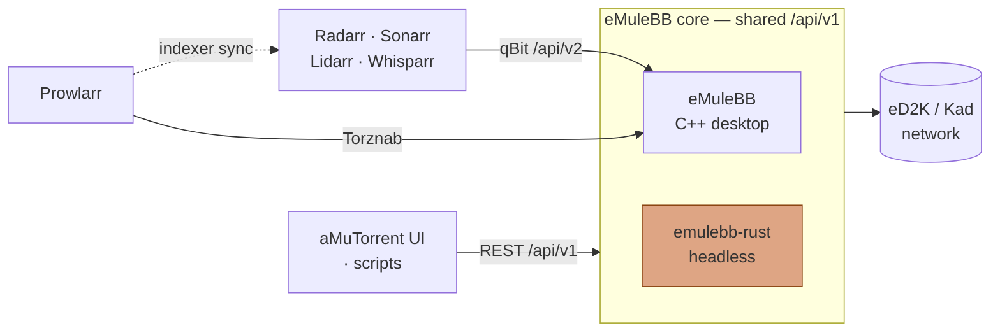

# eMuleBB

[](https://github.com/emulebb/emulebb/actions/workflows/baseline.yml)
[](https://github.com/emulebb/emulebb/actions/workflows/controlled-smoke.yml)
[](https://github.com/emulebb/emulebb/actions/workflows/nightly.yml)
[](https://github.com/emulebb/emulebb-build-tests/actions/workflows/fast-harness-ci.yml)
[](https://github.com/emulebb/emulebb-tooling/actions/workflows/docs-site.yml)
[](https://github.com/emulebb/emulebb-build/actions/workflows/baseline.yml)

This is the home of **eMuleBB**, the compact public name for
**eMule broadband edition**.

eMuleBB is its own product: a broadband-focused Windows eMule line for people
who still care about eD2K, Kad, rare files, deliberate sharing, long-running
desktop sessions, and local automation that respects native eMule behavior.

The organization around it is a practical P2P workshop. We build the desktop
client, the release and test machinery, the public documentation, controller
workflows, Windows build tracks for adjacent tools, and exploratory eD2K/Kad
projects that keep the protocol knowledge sharp. More is coming. Stay tuned.

The current public release candidate, **0.7.3-rc.2**, is published on GitHub
Releases with matching suite bootstrap and aMuTorrent controller packages.

## At A Glance

| Area | Current public status |
| --- | --- |
| Flagship product | eMuleBB, the compact name for eMule broadband edition |
| Release | `0.7.3-rc.2` is the current published release candidate |
| Platform | Windows desktop client, with x64 and ARM64 package proof in scope |
| Network | Stock-compatible eD2K and Kad behavior remains the default |
| Automation | Authenticated JSON REST API under `/api/v1` from the existing WebServer |
| Companion tools | Matching aMuTorrent RC2 package for eMuleBB management and controller-style workflows |
| Windows builds | aMule and MiniUPnP/miniupnpc build and validation tracks |
| P2P lab | goed2k work and p2p-overlord headless eD2K/Kad exploration |

## How It Fits Together

eMuleBB exposes a native `/api/v1` REST surface plus qBittorrent- and
Torznab-compatible adapters, so controllers like aMuTorrent and the Arr stack can
drive it without flattening native eD2K/Kad behavior. The same `/api/v1` contract
is implemented by both the C++ desktop and the headless **emulebb-rust** core, so
controllers work across them interchangeably.



REST `/api/v1` is the shared contract (C++ **and** `emulebb-rust`); the qBit
`/api/v2` and Torznab adapters are C++ desktop surfaces today.

## Install Or Try eMuleBB

RC2 is published on GitHub Releases. Choose one install path:

### Option 1: Manual Standalone ZIP

Use this path when you only want the eMuleBB desktop app.

1. Open
   [`emulebb-v0.7.3-rc.2`](https://github.com/emulebb/emulebb/releases/tag/emulebb-v0.7.3-rc.2).
2. Download `emulebb-0.7.3-rc.2-x64.zip`.
3. Extract the ZIP into a new version-specific folder, for example
   `C:\Apps\eMuleBB\0.7.3-rc.2`.
4. Run `emulebb.exe`.

Keep each version in its own application folder. Use a backed-up or disposable
profile for RC testing and support testing.

### Option 2: Full Suite PowerShell One-Liner

Use this path when you want eMuleBB plus aMuTorrent, Prowlarr, Radarr, and
Sonarr integration out of the box.

```powershell
irm https://github.com/emulebb/emulebb/releases/download/emulebb-v0.7.3-rc.2/Bootstrap-eMuleBBSuite.ps1 | iex
```

The bootstrapper downloads and verifies the matching release package, extracts
the suite installer, resolves the matching aMuTorrent RC2 package, and starts
the install flow. Advanced options and verification details are in the
[`Setup guide`](https://emulebb.github.io/emulebb-tooling/reference/GUIDE-SETUP/).

### Security And Provenance

All RC2 builds and packaging happen in GitHub Actions and are published through
GitHub Releases. The release includes ZIPs, manifests, SHA-256 evidence, SPDX
SBOMs, diagnostics packages, the suite bootstrapper, and the bootstrapper
SHA-256 asset. The bootstrapper verifies package hashes from the release
manifests before installing.

## RC2 Testing

We are open for testers now. Use the published RC2 packages if you want to help
shake out real Windows profiles, large libraries, controller/API workflows,
package contents, startup/shutdown behavior, and public-network regressions.

Use a disposable or backed-up profile when testing RC builds. Report crashes,
freezes, broken packages, UI regressions, REST/controller problems, and
repeatable live-network issues in
[`emulebb/issues`](https://github.com/emulebb/emulebb/issues).

Useful reports include the package name, architecture, Windows version, profile
type, exact launch command, repro steps, logs, diagnostic snapshots, and dumps
for crashes, hangs, or memory-growth cases.

## Build And Package Status

| Track | Status | Download |
| --- | --- | --- |
| eMuleBB | `0.7.3-rc.2` published as the first public release candidate | [`download RC2`](https://github.com/emulebb/emulebb/releases/tag/emulebb-v0.7.3-rc.2) |
| aMule | Nightly Windows build track available | [`releases`](https://github.com/emulebb/amule/releases) / [`nightlies`](https://github.com/emulebb/amule/releases?q=nightly&expanded=true) |
| aMuTorrent | Matching eMuleBB RC2 controller package published | [`download RC2`](https://github.com/emulebb/amutorrent/releases/tag/amutorrent-v3.8.5-emulebb-v0.7.3-rc.2) |
| MiniUPnP/miniupnpc | Windows `upnpc` package release available | [`releases`](https://github.com/emulebb/emulebb-miniupnp/releases) |

## What We Build

### eMuleBB

eMuleBB keeps the familiar desktop workflow at the center: servers, Kad search,
shared files, upload queues, categories, known clients, and long-running
control. Around that foundation it adds broadband-aware upload policy, safer
large-library operation, authenticated REST automation, performance-minded
defaults, and release evidence without creating an incompatible network fork.

### Management And Controller Workflows

The eMuleBB ecosystem includes an **aMuTorrent fork** focused on managing
eMuleBB and validating controller-style workflows. It sits beside the desktop
app instead of replacing it, and it keeps the native `/api/v1` contract as the
source of truth.

### Windows P2P Builds

We also provide Windows build and validation work for **aMule** and
**MiniUPnP/miniupnpc**. Those are ecosystem builds and distribution artifacts
for users who want these tools in the same Windows P2P workflow.

### P2P Lab Work

The exploratory side includes the **goed2k** fork/server work, the
**emulebb-rust** headless eMuleBB-family eD2K/Kad core that implements the common
`/api/v1` controller contract, and the broader **p2p-overlord** server-oriented
direction. This is where deeper protocol, automation, and server-oriented P2P
ideas can mature without pretending every experiment is already a stable
end-user product.

## Why Trust The Work

eMuleBB is being built as a tested desktop product, not a patched source tree.
Public claims stay tied to evidence: hosted fast CI, native tests, REST
contracts, UI and resource checks, live eD2K/Kad scenarios, controller lanes,
package provenance, GitHub Actions release packaging, GitHub Releases assets,
SBOMs, SHA-256 hashes, manifests, diagnostics packages, and explicit operator
gates.

Performance work is treated the same way. Claims are tied to concrete
operating surfaces: upload-slot policy, queue/source limits, socket and file
buffers, startup behavior, large shared libraries, long paths, controller
responsiveness, and long-running Windows sessions.

The result is a focused P2P organization: conservative where compatibility
matters, aggressive about validation, and serious about making classic eMule
usable on modern broadband systems.

## Quick Links

| Start here | Link |
| --- | --- |
| Website | [`emulebb.github.io`](https://emulebb.github.io/) |
| Community | [`Discord`](https://discord.gg/uWQa9g37) |
| Flagship source | [`emulebb`](https://github.com/emulebb/emulebb) |
| eMuleBB downloads | [`download RC2`](https://github.com/emulebb/emulebb/releases/tag/emulebb-v0.7.3-rc.2) |
| aMule downloads | [`releases`](https://github.com/emulebb/amule/releases) / [`nightlies`](https://github.com/emulebb/amule/releases?q=nightly&expanded=true) |
| aMuTorrent downloads | [`download RC2`](https://github.com/emulebb/amutorrent/releases/tag/amutorrent-v3.8.5-emulebb-v0.7.3-rc.2) |
| MiniUPnP downloads | [`releases`](https://github.com/emulebb/emulebb-miniupnp/releases) |
| User docs | [`Product guide`](https://emulebb.github.io/emulebb-tooling/reference/GUIDE-EMULEBB/) |
| Setup docs | [`Setup guide`](https://emulebb.github.io/emulebb-tooling/reference/GUIDE-SETUP/) |
| Use aMuTorrent with eMuleBB | [`Stack integration guide`](https://emulebb.github.io/emulebb-tooling/reference/GUIDE-STACK-INTEGRATIONS/) |
| Tools menu actions | [`Tools menu guide`](https://emulebb.github.io/emulebb-tooling/reference/GUIDE-TOOLS-MENU/) |
| Keyboard shortcuts | [`Keyboard shortcuts`](https://emulebb.github.io/emulebb-tooling/reference/KEYBOARD-SHORTCUTS/) |
| Adapter compatibility | [`REST adapter contracts`](https://emulebb.github.io/emulebb-tooling/rest/REST-API-ADAPTERS/) |
| Collect diagnostics for reports | [`Diagnostics guide`](https://emulebb.github.io/emulebb-tooling/reference/GUIDE-DIAGNOSTICS/) |
| Troubleshooting | [`Troubleshooting guide`](https://emulebb.github.io/emulebb-tooling/reference/GUIDE-TROUBLESHOOTING/) |
| Developer docs | [`Development guide`](https://emulebb.github.io/emulebb-tooling/reference/DEVELOPMENT-GUIDE/) |
| Release status | [`0.7.3 dashboard`](https://emulebb.github.io/emulebb-tooling/active/RELEASE-0.7.3/) |

## Primary Repositories

- [`emulebb`](https://github.com/emulebb/emulebb) - flagship desktop app and product source
- [`emulebb-setup`](https://github.com/emulebb/emulebb-setup) - reproducible workspace setup
- [`emulebb-build`](https://github.com/emulebb/emulebb-build) - build, validation, and release orchestration
- [`emulebb-build-tests`](https://github.com/emulebb/emulebb-build-tests) - native, Python, UI, REST, and live E2E tests
- [`emulebb-tooling`](https://github.com/emulebb/emulebb-tooling) - roadmap, backlog, policy, audits, and reference docs
- [`amutorrent`](https://github.com/emulebb/amutorrent) - fork used for eMuleBB management and controller workflows
- [`goed2k-server`](https://github.com/emulebb/goed2k-server) - eD2K server work for deterministic tests and ecosystem services
- [`emulebb-rust`](https://github.com/emulebb/emulebb-rust) - headless eMuleBB-family eD2K/Kad core implementing the common `/api/v1` controller contract
- [`p2p-overlord-agents`](https://github.com/emulebb/p2p-overlord-agents) and [`p2p-overlord-be`](https://github.com/emulebb/p2p-overlord-be) - exploratory headless/server-oriented P2P work

## Build Tracks And Adjacent Tools

- [`aMule`](https://github.com/emulebb/amule) - Windows build and validation track for aMule users
- [`emulebb-miniupnp`](https://github.com/emulebb/emulebb-miniupnp) - Windows build and validation track for MiniUPnP/miniupnpc

## Project Principles

- eMuleBB is the product identity; eMule broadband edition is the full product name.
- Keep stock eD2K/Kad protocol compatibility as the default.
- Improve the classic desktop app instead of replacing it with a rewrite.
- Treat REST and controller support as product features.
- Make Windows packages, build evidence, and release gates inspectable.
- Keep exploratory P2P work visible, useful, and clearly labeled.
- Sell the expertise by proving the work.
